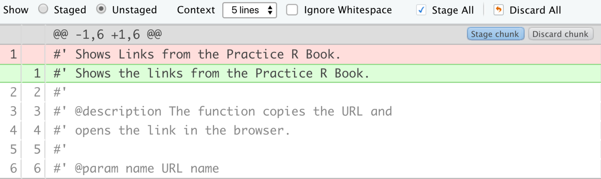
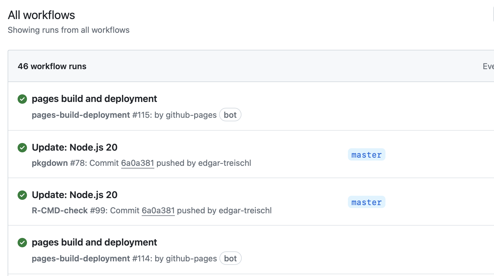
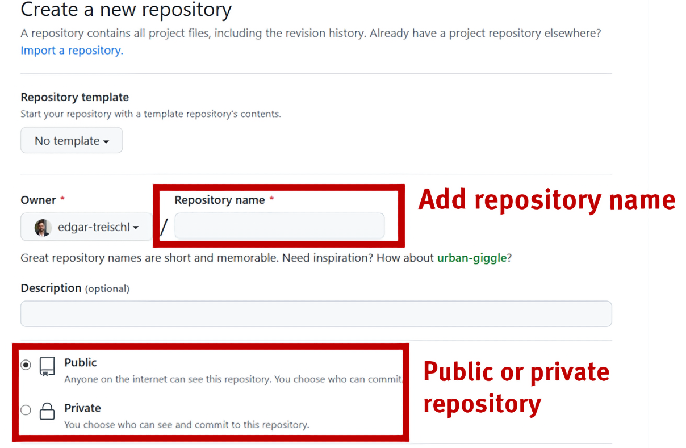
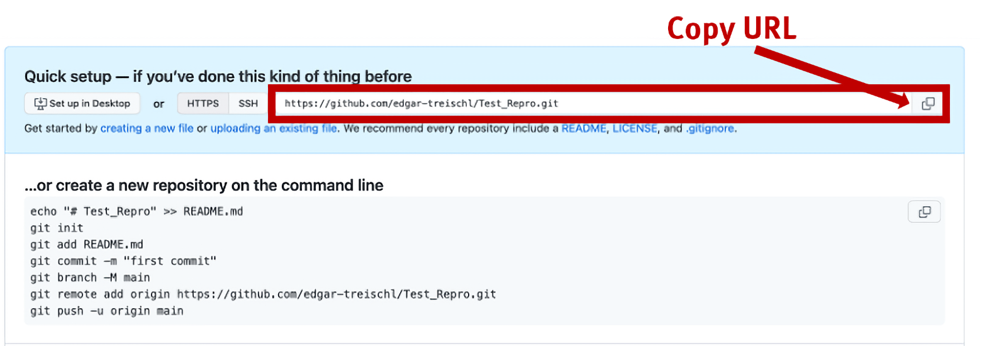
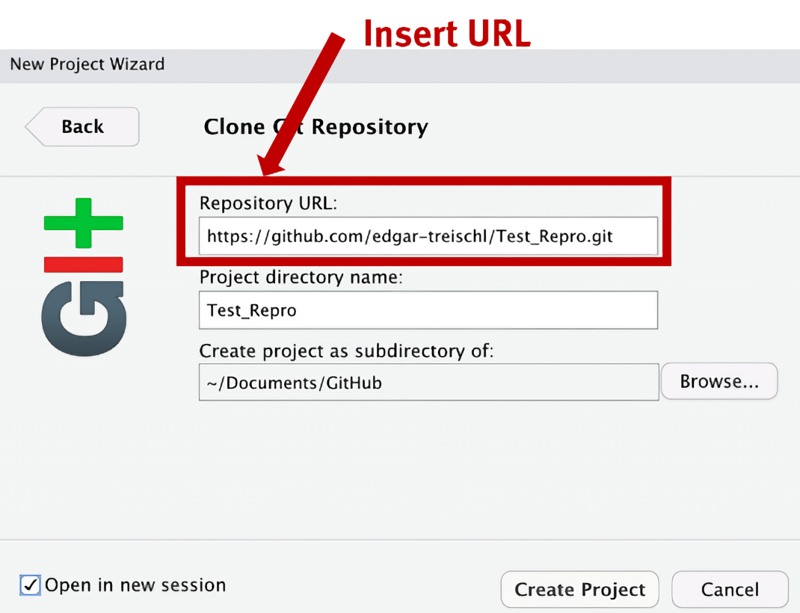
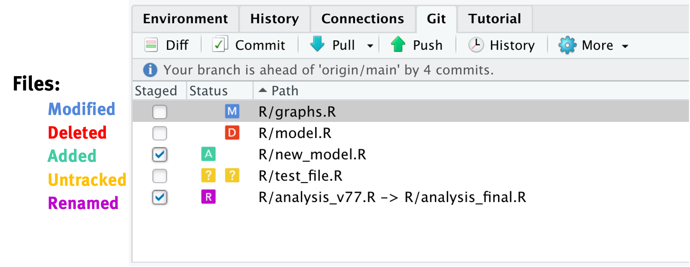
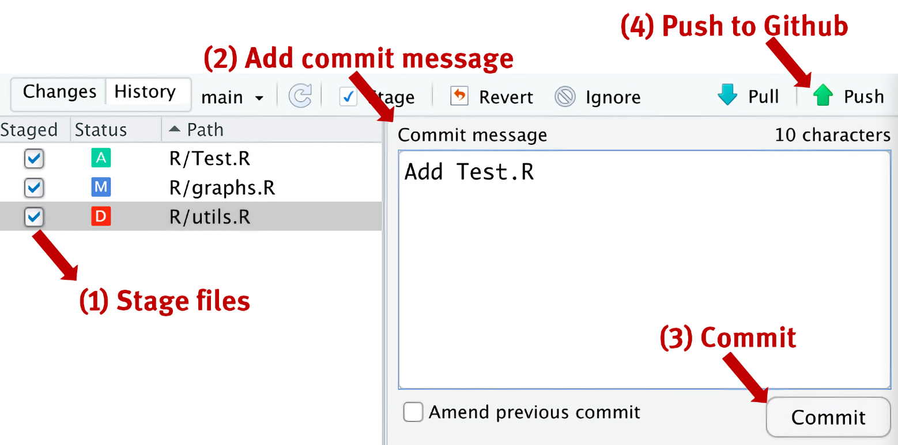
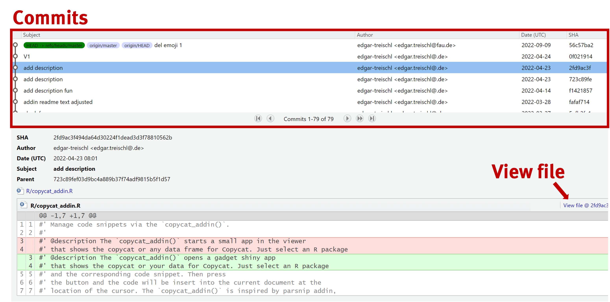
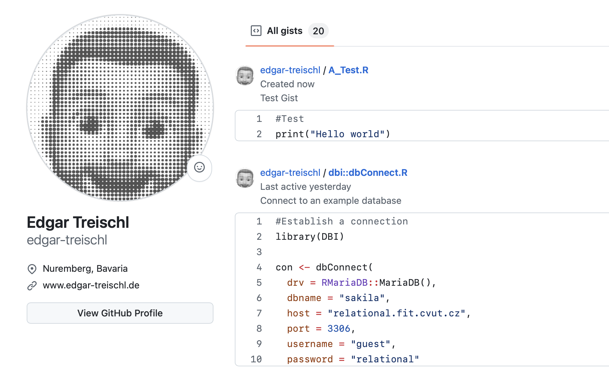

class: center, middle


```{r setup, include=FALSE}
options(htmltools.dir.version = FALSE)

library(ggplot2)
library(tidyverse)
library(readr)
library(gridExtra)
library(cowplot)

#library(jtools)


knitr::opts_chunk$set(fig.retina = 3, warning = FALSE, message = FALSE)


theme_set(theme_minimal(base_size = 20)) # sets a default ggplot theme

has_bash <- Sys.which('bash') != '' && .Platform$OS.type != 'windows'

library(RefManageR)
bib <- ReadBib("PracticeR_FINAL.bib", check = FALSE)
ui <- "- "
```


```{r best-features, echo=FALSE}
#search
xaringanExtra::use_search(show_icon = TRUE, position = "top-right")

xaringanExtra::use_progress_bar(color = "#023047", location = "top")

xaringanExtra::style_search(match_background = "black",
                            input_background = "white",
                            input_border = "black",
                            match_current_background = "green")


xaringanExtra::use_panelset()

```


```{r xaringan-themer, include=FALSE, warning=FALSE}
library(xaringanthemer)
style_mono_accent(
  base_color = "black",
  header_font_google = google_font("Lato"),
  text_font_google   = google_font("Montserrat", "300", "300i"),
  code_font_google   = google_font("Fira Code")
)
```


  
## Introduction to Git and GitHub

.large[Dr. Edgar J. Treischl] <br>
<a href="www.edgar-treischl.de" target="_blank">www.edgar-treischl.de</a>
<br/>
<br/>
.large[Last update: `r Sys.Date()`]
<br/>
<br/>
This presentation is licensed under a CC-BY-NC 4.0 license.
You may copy, distribute, and use the slides in your own work, as long as you give attribution to the original author on each slide that you use. Commercial use of the contents of these slides is not allowed.


```{css, echo = F}
.reduced_opacity {
  opacity: 0.5;
}
```


---
## `r emoji::emoji("schedule")` Agenda


.pull-left[

### `r emoji::emoji("one")` Git/GitHub ... What?
### `r emoji::emoji("two")` Getting Started
### `r emoji::emoji("three")` Basics of Git
### `r emoji::emoji("four")` Practice Makes Perfect
### `r emoji::emoji("five")` Gist


]

.pull-right[


<a href="https://edgar-treischl.github.io/PracticeR/" target="_blank"></a>

This workshop is based on Practice R.
]


---
background-image: url("images/ibm.gif")
background-size: cover
class: bottom, center

# .white[`r emoji::emoji("one")` Git/GitHub ... What?] 


---

## Git/GitHub ... What?

.left-column[
<br/>
<a href="https://git-scm.com/" target="_blank"></a>
<br/>
<br/>
<br/>
<a href="https://github.com" target="_blank"></a>

]

.right-column[
- Git is a version control system to track changes over time
- Continuous integration (CI) and continuous deployment (CD)
- GitHub is an host (website) for Git-based projects
- Each project is stored in a repository (folder with all files)
- A repository can be *public* or *private*


### Why GitHub?

- Track code
- Share work
- Automate workflows
- Work together
- ...

]


---
## Git/GitHub ... What?


.panelset[
.panel[.panel-name[Track Code]


]

.panel[.panel-name[Share Code]

.pull-left[
```{r plot-last, fig.show = 'hide', eval=FALSE}
#Source the script from the raw github link
#The raw github link
link <- "https://raw.githubusercontent.com/
        edgar-treischl/.../file.R"

#source_url: Source a script from a url
devtools::source_url(link)
```

```{r eval=FALSE}
#runGitHub: Run a shiny app from GitHub
shiny::runGitHub("power-app", 
                 "edgar-treischl", 
                 ref="main")
```

]
.pull-right[

]


]

.panel[.panel-name[Automate workflows]

.pull-left[

```yaml
on:
  push:
    branches: [main, master]
    
jobs:
  pkgdown:
    runs-on: ubuntu-latest
    steps:
    - uses: my_script.R
```


]

.pull-right[

]
]

.panel[.panel-name[...]

- Work together
- Host websites for projects
- GitHub Gist
- ...

]
]


---
background-image: url("images/g3.gif")
background-size: cover
class: bottom, center

# .white[`r emoji::emoji("two")` Getting Started] 


---
## Getting Started: Install Git

.left-column[
<br/>
<a href="https://git-scm.com/" target="_blank"></a>
<br/>
<br/>
<br/>
<a href="https://github.com" target="_blank"></a>

]

.right-column[

- Windows: https://git-scm.com/download/win
- OS X: https://git-scm.com/download/mac
- Debian/Ubuntu: sudo apt-get install git-core


```{bash eval = has_bash}
# I am git code to check if git is installed
# Go to the console and type:
git --version
```


- Create a free GitHub account

]


---
background-image: url(https://usethis.r-lib.org/logo.png)
background-position: 90% 5%
background-size: 10%

## Getting Started: Introduce Yourself


### Via the shell or ...

```bash
#In the console
git config --global user.name "User Name"
git config --global user.email "email@adress.com"

```

### With the usethis package

```{r, eval=FALSE}
library(usethis)
use_git_config(user.name = "Jane Doe",
               user.email = "jane@example.org")
```


---
## Getting Started: Introduce Yourself

### The list option returns all settings

```{bash eval = has_bash}
git config --global --list
```


---
## Getting Started: New Vocabulary

.pull-left[

- **Repository**: A folder with all project files
- **Push**: Send code (files) to Git 
- **Pull**: Get code (files) from a Git repository
- **Commit**: A snapshot of a repository at a certain point in time
- **Branch**: A parallel version within the repository to test new features


]

.pull-right[
<figure>
    
    <figcaption style = "color: darkgray;">'Artwork by @allison_horst'</figcaption>
</figure>
]


---
## Getting Started: New Vocabulary


.pull-left[

- **Merge**: Combine two branches
- **Merge conflicts**: When two branches have changed the same part of a file, Git will not be able to automatically determine what is correct
- **Forks**: Forks are interconnected repositories, for example, to examine a repository from someone else
- **Pull requests**: A way to suggest changes to a repository


]


.pull-right[
<figure>
    
    <figcaption style = "color: darkgray;">'Artwork by @allison_horst'</figcaption>
</figure>
]


---
## Getting Started: Connect to GitHub

### Create a Personal Access Token

- Homepage: Settings > Developer settings > Personal access tokens: https://github.com/settings/tokens

### Connect to GitHub via R:

```{r, eval=FALSE}
# Create a token: The create_github_token() function will open a 
#browser window to create a token
usethis::create_github_token()

#Set the token: The set_github_pat() function will store 
#the token in the .Renviron file
credentials::set_github_pat("token")

```


---
## Getting Started: Connect to GitHub


```{r}
#Finally, whoami will show you who you are on GitHub
gh::gh_whoami()
```


---
## Getting Started: Create a Repository




---
## Getting Started: Quick Setup


---
## Getting Started: Setup in RStudio




---
## Getting Started: Git Pane in RStudio I



---
## Getting Started: Git Pane in RStudio II




---
background-image: url("images/merge.gif")
background-size: cover
class: bottom, center

# .white[`r emoji::emoji("three")` Basics of Git] 


---
## Basics of Git: Basic setup

```bash
#git init: Initialize a new repository
git init <your repository name>

#git clone: Clone a repository
git clone <git-repo-url>

#git branch: Create a new branch
git branch <branch-name>

#git branch --list: List all branches
git branch --list

#git branch -d: Delete a branch
git branch -d <branch-name>

#git checkout: Switch to a branch
git checkout <branch-name>
```


---
## Basics of Git: Daily workflow

.pull-left[

```bash
#git add: Add a file to the staging area
git add <file-name-1>

#-A: Add all files to the staging area
git add -A

#git commit -am: Commit changes
git commit -am <commit-message>

#git push: Push changes to the remote rep
git push <remote> <branch-name>

#git pull: Pull changes from the remote rep
git pull

#git merge: Merge two branches
git merge <branch-name>
```


]

.pull-right[
<br/>
<br/>
<figure>
    
    <figcaption style = "color: darkgray;">'Artwork by @allison_horst'</figcaption>
</figure>
]


---
## Basics of Git: Troubleshooting `r emoji::emoji("skull")`

.pull-left[

```bash
#git blame: Shows who changed what and when
git blame file.txt

#git status: Shows the working tree status
git status

#git diff: Shows changes between commits
git diff

#💀💀💀 DANGER
#git revert: used to revert some existing commits
git revert SHA

#git reset: Reset the repository to a previous 
#commit discarding any local changes
git reset 

#git reset --hard SHA
#A "hard reset": forcefully discard any 
# local changes and modifications
```

]
.pull-right[
<br/>
<br/>
<a href="https://git-scm.com/book/de/v2" target="_blank"></a>
]


---
## Basics of Git: Commit history




---
background-image: url("images/practice.gif")
background-size: cover
class: bottom, center

# .white[`r emoji::emoji("four")` Practice Makes Perfect] 


---
## Practice Makes Perfect

### `r emoji::emoji("plus")` Create a new repository on GitHub  
### `r emoji::emoji("pc")` Clone the repository on your local machine
### `r emoji::emoji("file")` Add a new repository file
### `r emoji::emoji("button")` Commit the changes
### `r emoji::emoji("mail")` Push the changes to the remote repository


---
background-image: url("images/bite.gif")
background-size: cover
class: bottom, center

# .black[`r emoji::emoji("five")` Gist]


---
## Gist

.panelset[

.panel[.panel-name[Package]

.pull-left[
#### The gist package provides a set of functions to work with GitHub Gist. 

#### It allows you to copy, create, and delete gists via the GitHub API. Moreover, it comes with an R Studio addin - a shiny app - to manage your Gists.
]


.pull-right[
<a href="https://edgar-treischl.github.io/gist/" target="_blank"></a>
]


]

.panel[.panel-name[Workflow]

.pull-left[

```{r, eval=FALSE}
library(gist)
#Create a gist
gist_create(name = "A_Test.R", 
            code = '#Test
print("Hello world")', 
            description = "Test Gist")
```

```{r, eval=FALSE}
#gistfiles lists all files and returns names and ids
gist_get(filename = "A_Test.R")

#> ✔ Copied A_Test.R from your GitHub account.
```


]

.pull-right[

]
]

.panel[.panel-name[Addin]

.pull-left[

#### Further functions: Delete and list gists

#### R Studio Addin: 

```{r, eval=FALSE}
#The gistAddin()
gist::gistAddin()
```


]

.pull-right[

]

]
]


---
class: center, middle

.left-column[

## Keep in touch

#### <a href="https://edgar-treischl.de" target="_blank"><br/>www.edgar-treischl.de</a>
<br/>

#### <a href="https://github.com/edgar-treischl" target="_blank"><br/>edgar-treischl</a>


]

.right-column[


## Thank you for your attention!
<br/>


]


---

## References


```{r, print_refs, results='asis', echo=FALSE, warning=FALSE, message=FALSE}

print(bib[key = "chacon_pro_2014"], 
  .opts = list(check.entries = FALSE, 
               style = "html", 
               bib.style = "authoryear"))

print(bib[key = "shiny"], 
  .opts = list(check.entries = TRUE, 
               style = "html", 
               bib.style = "authoryear"))

print(bib[key = "treischl_practice_2023"], 
  .opts = list(check.entries = FALSE, 
               style = "html", 
               bib.style = "authoryear"))

print(bib[key = "usethis"], 
  .opts = list(check.entries = FALSE, 
               style = "html", 
               bib.style = "authoryear"))

print(bib[key = "devtools"], 
  .opts = list(check.entries = FALSE, 
               style = "html", 
               bib.style = "authoryear"))

```


